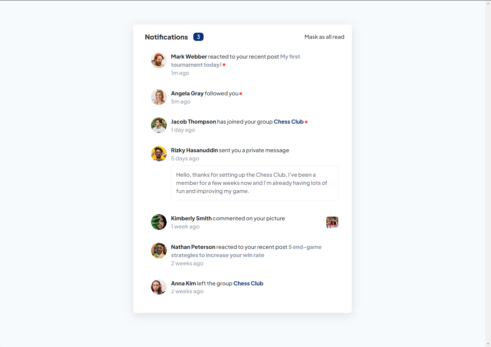

# Frontend Mentor - Notifications page solution

This is a solution to the [Notifications page challenge on Frontend Mentor](https://www.frontendmentor.io/challenges/notifications-page-DqK5QAmKbC). Frontend Mentor challenges help you improve your coding skills by building realistic projects. 

## Table of contents

- [Frontend Mentor - Notifications page solution](#frontend-mentor---notifications-page-solution)
  - [Table of contents](#table-of-contents)
  - [Overview](#overview)
    - [The challenge](#the-challenge)
    - [Screenshot](#screenshot)
      - [Desktop (1440x900)](#desktop-1440x900)
      - [Mobile (375x812)](#mobile-375x812)
    - [Links](#links)
  - [My process](#my-process)
    - [Built with](#built-with)
    - [What I learned](#what-i-learned)
    - [Useful resources](#useful-resources)
  - [Author](#author)

**Note: Delete this note and update the table of contents based on what sections you keep.**

## Overview

### The challenge

Users should be able to:

- Distinguish between "unread" and "read" notifications
- Select "Mark all as read" to toggle the visual state of the unread notifications and set the number of unread messages to zero
- View the optimal layout for the interface depending on their device's screen size
- See hover and focus states for all interactive elements on the page

### Screenshot

#### Desktop (1440x900) 

#### Mobile (375x812) 

### Links

- Solution URL: [https://github.com/devel0na/notifications-challenge](https://github.com/devel0na/notifications-challenge)
- Live Site URL: [https://effortless-dango-1768a9.netlify.app](https://effortless-dango-1768a9.netlify.app)

## My process

I wanted to create a project using React and SaSS by myself. First thing I did was create a new react-app, then I proceed to configure the whole project based on services folder. After that, I included SaSS (I actually thought that including SaSS mean just create .scss files and it's done haha). Finally, the process:

1. Create an Object that had a generic structure and could help me on the special cases such as notifications comments or private messages.
2. Build a Notification.jsx component that wraps up the notification structure.
3. Inside Notification.jsx, create another three components based on the type of notification, hadling special cases.
4. Apply final styles and active states.
### Built with

- HTML5
- SaSS
- Flexbox
- [React](https://reactjs.org/) - JS library

### What I learned

I learned to build a React/SaSS project by myself! I create the whole design system model into an organized structure on SaSS. Im very proud.

### Useful resources

- [How to Use Sass in React](https://www.makeuseof.com/react-sass-how-use/) - This helped me on setting up SaSS into the project. This article does not include how to avoid multiple imports using main.scss. I recommend you to check my project and see how it works (it's actually just one step more, but useful).

## Author

- Frontend Mentor - [@evjaimes](https://www.frontendmentor.io/profile/evjaimes)
- Twitter - [@devel0na](https://www.twitter.com/devel0na)

